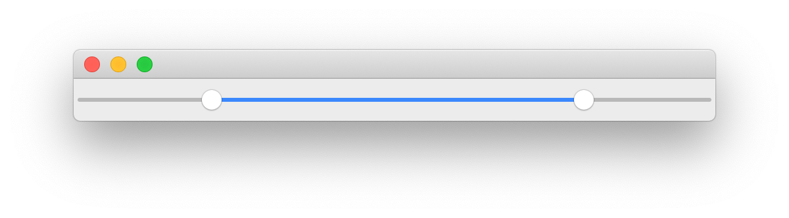

# QtRangeSlider

[](https://github.com/tlambert03/QtRangeSlider/raw/master/LICENSE)
[](https://pypi.org/project/QtRangeSlider)
[](https://python.org)
[](https://github.com/tlambert03/QtRangeSlider/actions/workflows/test_and_deploy.yml)
[](https://codecov.io/gh/tlambert03/QtRangeSlider)

**The missing multi-handle range slider widget for PyQt & PySide**



The goal of this package is to provide a Range Slider (a slider with 2 or more
handles) that feels as "native" as possible.  Styles should match the OS by
default, and the slider should behave like a standard
[`QSlider`](https://doc.qt.io/qt-5/qslider.html)... but with multiple handles!

- `QRangeSlider` inherits from [`QSlider`](https://doc.qt.io/qt-5/qslider.html)
  and attempts to match the Qt API as closely as possible
- Uses platform-specific styles (for handle, groove, & ticks) but also supports
  QSS style sheets.
- Supports mouse wheel and keypress (soon) events
- Supports PyQt5, PyQt6, PySide2 and PySide6
- Supports more than 2 handles (e.g. `slider.setValue([0, 10, 60, 80])`)

## Installation

You can install `QtRangeSlider` via pip:

```sh
pip install qtrangeslider

# NOTE: you must also install a Qt Backend.
# PyQt5, PySide2, PyQt6, and PySide6 are supported
# As a convenience you can install them as extras:
pip install qtrangeslider[pyqt5]
```


------

## API

To create a slider:

```python
from qtrangeslider import QRangeSlider

# as usual:
# you must create a QApplication before create a widget.
range_slider = QRangeSlider()
```

As `QRangeSlider` inherits from `QtWidgets.QSlider`, you can use all of the
same methods available in the [QSlider API](https://doc.qt.io/qt-5/qslider.html).  The major difference is that `value` and `sliderPosition` are reimplemented as `tuples` of `int` (where the length of the tuple is equal to the number of handles in the slider.)

### value: Tuple[int, ...]

This property holds the current value of all handles in the slider.

The slider forces all values to be within the legal range:
`minimum <= value <= maximum`.

Changing the value also changes the sliderPosition.

##### Access Functions:

```python
range_slider.value() -> Tuple[int, ...]
```

```python
range_slider.setValue(val: Sequence[int]) -> None
```

##### Notifier Signal:

```python
valueChanged(Tuple[int, ...])
```

### sliderPosition: Tuple[int, ...]

This property holds the current slider positions.  It is a `tuple` with length equal to the number of handles.

If [tracking](https://doc.qt.io/qt-5/qabstractslider.html#tracking-prop) is enabled (the default), this is identical to [`value`](#value--tupleint-).

##### Access Functions:

```python
range_slider.sliderPosition() -> Tuple[int, ...]
```

```python
range_slider.setSliderPosition(val: Sequence[int]) -> None
```

##### Notifier Signal:

```python
sliderMoved(Tuple[int, ...])
```

------

## Example

These screenshots show `QRangeSlider` (multiple handles) next to the native `QSlider`
(single handle). With no styles applied, `QRangeSlider` will match the native OS
style of `QSlider` – with or without tick marks.  When styles have been applied
using [Qt Style Sheets](https://doc.qt.io/qt-5/stylesheet-reference.html), then
`QRangeSlider` will inherit any styles applied to `QSlider` (since it inherits
from QSlider).  If you'd like to style `QRangeSlider` differently than `QSlider`,
then you can also target it directly in your style sheet.

> The code for these example widgets is [here](examples/demo_widget.py)

<details>

<summary><em>See style sheet used for this example</em></summary>

```css
/* Because QRangeSlider inherits QSlider, it will also inherit styles */
QSlider::groove:horizontal {
   border: 0px;
   background: qlineargradient(x1:0, y1:0, x2:1, y2:1, stop:0 #777, stop:1 #aaa);
   height: 20px;
   border-radius: 10px;
}

QSlider::handle {
    background: qradialgradient(cx:0, cy:0, radius: 1.2, fx:0.5,
                                fy:0.5, stop:0 #eef, stop:1 #000);
    height: 20px;
    width: 20px;
    border-radius: 10px;
}

/* "QSlider::sub-page" (which styles the area to the left of the
QSlider handle) is the one exception ... */
QSlider::sub-page:horizontal {
    background: #447;
    border-top-left-radius: 10px;
    border-bottom-left-radius: 10px;
}

/* for QRangeSlider, use "qproperty-barColor" */
QRangeSlider {
    qproperty-barColor: #447;
}
```

</details>

### macOS

##### Catalina


##### Big Sur


### Windows


### Linux


## Issues

If you encounter any problems, please [file an issue] along with a detailed
description.

[file an issue]: https://github.com/tlambert03/QtRangeSlider/issues
