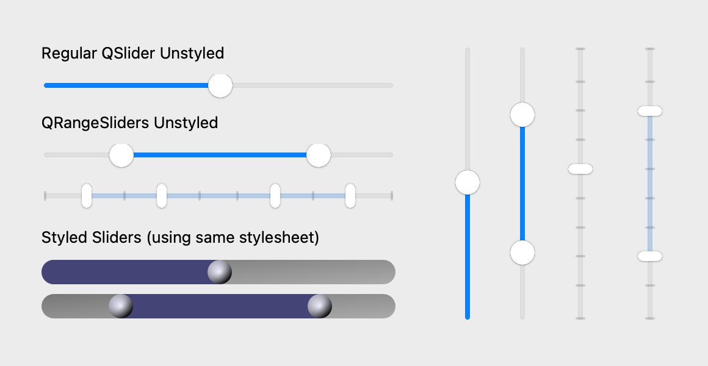

# QRangeSlider

A multi-handle slider widget than can be used to
select a range of values.

```python
from qtpy.QtCore import Qt
from qtpy.QtWidgets import QApplication

from superqt import QRangeSlider

app = QApplication([])

slider = QRangeSlider(Qt.Orientation.Horizontal)
slider.setValue((20, 80))
slider.show()

app.exec_()
```

{{ show_widget() }}

- `QRangeSlider` inherits from [`QSlider`](https://doc.qt.io/qt-6/qslider.html)
  and attempts to match the Qt API as closely as possible
- It uses platform-specific styles (for handle, groove, & ticks) but also supports
  QSS style sheets.
- Supports mouse wheel events
- Supports more than 2 handles (e.g. `slider.setValue([0, 10, 60, 80])`)

As `QRangeSlider` inherits from
[`QtWidgets.QSlider`](https://doc.qt.io/qt-6/qslider.html), you can use all of
the same methods available in the [QSlider
API](https://doc.qt.io/qt-6/qslider.html). The major difference is that `value()`
and `sliderPosition()` are reimplemented as `tuples` of `int` (where the length of
the tuple is equal to the number of handles in the slider.)

These options are in addition to the Qt QSlider API, and control the behavior of the bar between handles.

| getter               | setter                                      | type   | default | description                                                                                      |
| -------------------- | ------------------------------------------- | ------ | ------- | ------------------------------------------------------------------------------------------------ |
| `barIsVisible`       | `setBarIsVisible` <br>`hideBar` / `showBar` | `bool` | `True`  | <small>Whether the bar between handles is visible.</small>                                       |
| `barMovesAllHandles` | `setBarMovesAllHandles`                     | `bool` | `True`  | <small>Whether clicking on the bar moves all handles or just the nearest</small>                 |
| `barIsRigid`         | `setBarIsRigid`                             | `bool` | `True`  | <small>Whether bar length is constant or "elastic" when dragging the bar beyond min/max.</small> |

###  Screenshots

??? title "code that generates the images below"

    ```python
    import os

    from qtpy import QtCore
    from qtpy import QtWidgets as QtW

    # patch for Qt 5.15 on macos >= 12
    os.environ["USE_MAC_SLIDER_PATCH"] = "1"

    from superqt import QRangeSlider  # noqa

    QSS = """
    QSlider {
        min-height: 20px;
    }

    QSlider::groove:horizontal {
        border: 0px;
        background: qlineargradient(x1:0, y1:0, x2:1, y2:1, stop:0 #888, stop:1 #ddd);
        height: 20px;
        border-radius: 10px;
    }

    QSlider::handle {
        background: qradialgradient(cx:0, cy:0, radius: 1.2, fx:0.35,
                                    fy:0.3, stop:0 #eef, stop:1 #002);
        height: 20px;
        width: 20px;
        border-radius: 10px;
    }

    QSlider::sub-page:horizontal {
        background: qlineargradient(x1:0, y1:0, x2:1, y2:1, stop:0 #227, stop:1 #77a);
        border-top-left-radius: 10px;
        border-bottom-left-radius: 10px;
    }

    QRangeSlider {
        qproperty-barColor: qlineargradient(x1:0, y1:0, x2:1, y2:1, stop:0 #227, stop:1 #77a);
    }
    """

    Horizontal = QtCore.Qt.Orientation.Horizontal


    class DemoWidget(QtW.QWidget):
        def __init__(self) -> None:
            super().__init__()

            reg_hslider = QtW.QSlider(Horizontal)
            reg_hslider.setValue(50)
            range_hslider = QRangeSlider(Horizontal)
            range_hslider.setValue((20, 80))
            multi_range_hslider = QRangeSlider(Horizontal)
            multi_range_hslider.setValue((11, 33, 66, 88))
            multi_range_hslider.setTickPosition(QtW.QSlider.TickPosition.TicksAbove)

            styled_reg_hslider = QtW.QSlider(Horizontal)
            styled_reg_hslider.setValue(50)
            styled_reg_hslider.setStyleSheet(QSS)
            styled_range_hslider = QRangeSlider(Horizontal)
            styled_range_hslider.setValue((20, 80))
            styled_range_hslider.setStyleSheet(QSS)

            reg_vslider = QtW.QSlider(QtCore.Qt.Orientation.Vertical)
            reg_vslider.setValue(50)
            range_vslider = QRangeSlider(QtCore.Qt.Orientation.Vertical)
            range_vslider.setValue((22, 77))

            tick_vslider = QtW.QSlider(QtCore.Qt.Orientation.Vertical)
            tick_vslider.setValue(55)
            tick_vslider.setTickPosition(QtW.QSlider.TicksRight)
            range_tick_vslider = QRangeSlider(QtCore.Qt.Orientation.Vertical)
            range_tick_vslider.setValue((22, 77))
            range_tick_vslider.setTickPosition(QtW.QSlider.TicksLeft)

            szp = QtW.QSizePolicy.Maximum
            left = QtW.QWidget()
            left.setLayout(QtW.QVBoxLayout())
            left.setContentsMargins(2, 2, 2, 2)
            label1 = QtW.QLabel("Regular QSlider Unstyled")
            label2 = QtW.QLabel("QRangeSliders Unstyled")
            label3 = QtW.QLabel("Styled Sliders (using same stylesheet)")
            label1.setSizePolicy(szp, szp)
            label2.setSizePolicy(szp, szp)
            label3.setSizePolicy(szp, szp)
            left.layout().addWidget(label1)
            left.layout().addWidget(reg_hslider)
            left.layout().addWidget(label2)
            left.layout().addWidget(range_hslider)
            left.layout().addWidget(multi_range_hslider)
            left.layout().addWidget(label3)
            left.layout().addWidget(styled_reg_hslider)
            left.layout().addWidget(styled_range_hslider)

            right = QtW.QWidget()
            right.setLayout(QtW.QHBoxLayout())
            right.setContentsMargins(15, 5, 5, 0)
            right.layout().setSpacing(30)
            right.layout().addWidget(reg_vslider)
            right.layout().addWidget(range_vslider)
            right.layout().addWidget(tick_vslider)
            right.layout().addWidget(range_tick_vslider)

            self.setLayout(QtW.QHBoxLayout())
            self.layout().addWidget(left)
            self.layout().addWidget(right)
            self.setGeometry(600, 300, 580, 300)
            self.activateWindow()
            self.show()


    if __name__ == "__main__":

        import sys
        from pathlib import Path

        dest = Path("screenshots")
        dest.mkdir(exist_ok=True)

        app = QtW.QApplication([])
        demo = DemoWidget()

        if "-snap" in sys.argv:
            import platform

            QtW.QApplication.processEvents()
            demo.grab().save(str(dest / f"demo_{platform.system().lower()}.png"))
        else:
            app.exec_()
    ```

#### macOS

##### Catalina

{ width=580; }

##### Big Sur

{ width=580; }

#### Windows


#### Linux


{{ show_members('superqt.sliders._sliders._GenericRangeSlider') }}

## Type changes

Note the following changes in types compared to the `QSlider` API:

```python
value() -> Tuple[int, ...]
```

```python
setValue(val: Sequence[int]) -> None
```

```python
# Signal
valueChanged(Tuple[int, ...])
```

```python
sliderPosition() -> Tuple[int, ...]
```

```python
setSliderPosition(val: Sequence[int]) -> None
```

```python
sliderMoved(Tuple[int, ...])
```
